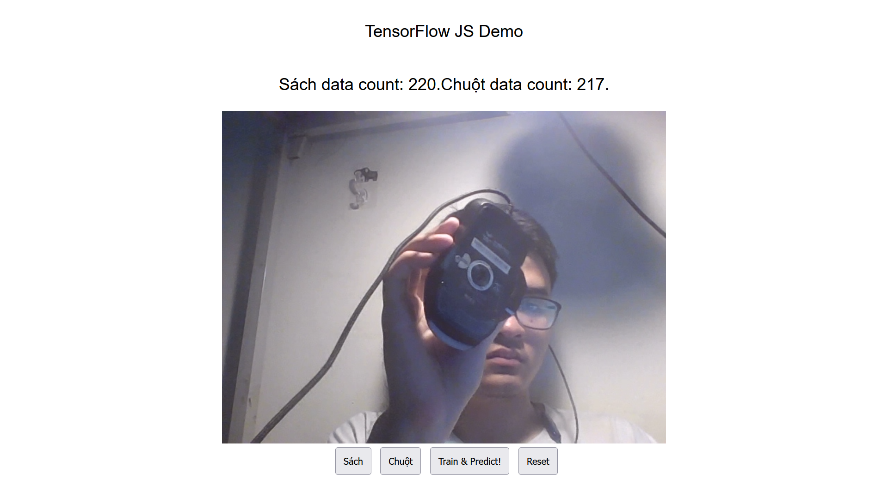

# en_4_cs_project
<h1>English for Computer Science Final Project</h1>

<h2>Introduction</h2>
<h3>What is this project about?</h3>

This project is a website that uses Tensorflow JS to collect data, train and predict real-time thanks to the combination of BaseModel MobileNetv3 and your own data

<h3>Who did this project?</h3>

Bui Duong Kham, a student of Faculty of CS at Phenikaa University

<h2>The Usage:</h2>
<h3>Step 1: Clone this project</h3>
<h3>Step 2: Open the web page</h3>

Open the index.html file in your browser. It's likely to look like this:

After loading completely, your web page looks like this. You can enter any name of class which you need to classify in the form then click "Save" 

    
Then, click the "Enable Webcam", the web page will ask you to allow the web page to use your camera.Of course, you need to click "Allow" to continue

    
After that, you can see the video from your camera and 2 buttons named after 2 classname you entered above. Press and hold on each to start collecting data for each class

    
    

<h3>Step 3: Train the model</h3>

Just click on a button named "Train and predict" and be patient because the training progress could last a bit long

<h3>Step 4: Enjoy</h3>

After the training progress is done, you can see the result of the prediction. The result is the class which has the highest probability

<h2>Conclusion</h2>

Thanks for reading this README file. Hope you enjoy this project

